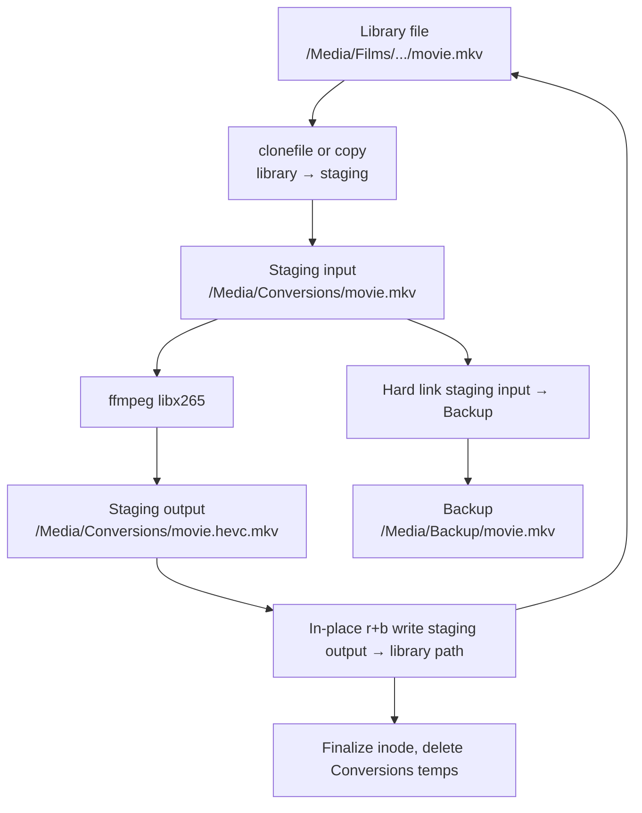

# Backup and Copy-Over Design

## Overview

This document covers post-conversion **backup** and **copy-over**: keeping the original safe, then putting the HEVC file in the library path. It records a failed run on an exFAT USB drive (historical) and defines the **target deployment** on a Mac Mini with an **8 TB APFS SSD**.

The **NAS is retired.** Walker and Converter both run on the Mac Mini in the **same Docker Compose project**, sharing one `/Media` mount and one MongoDB. There is no cross-host `path_map`.

Encoder: **`libx265` only** (Docker on the Mac Mini).

**Filesystem (confirmed):** the 8 TB SSD will be formatted as **APFS**. All design assumptions — hard links, stable inodes, same-volume operations, in-place rewrite, optional `clonefile` — depend on APFS.

---

## Target deployment (Mac Mini + 8 TB APFS SSD)

### Filesystem

The SSD is **APFS** (Apple File System). Fixed requirement, not a recommendation.

| Capability | Required for | APFS |
| --- | --- | --- |
| Hard links (same volume) | Instant backup of staging input | Yes |
| Stable `st_ino` | Walker rename vs delete detection | Yes |
| In-place file rewrite (`"r+b"`) | Plex-safe copy-over (same inode) | Yes |
| Same-volume `rename` / `replace` | Fallback commit only | Yes |
| `clonefile` (optional) | Fast library → staging copy | Yes (COW clone) |

Do **not** use exFAT, FAT32, or NTFS on this disk.

**APFS case sensitivity (confirmed):** **case-insensitive** APFS (standard APFS, not APFS Case-sensitive). Prefer consistent casing in MongoDB and on disk for clarity; the volume itself does not treat `Film` and `film` as different names.

### Services (Docker Compose)

Walker and Converter run as separate containers in one compose file on the Mac Mini. Both mount the same APFS tree; only `FOLDER_WALKER` differs.

```yaml
services:
  walker-1:
    build: walker
    environment:
      - FOLDER_WALKER=TRUE
      - DB_URL=mongodb://host.docker.internal:27017/   # or mongodb service name
    volumes:
      - ./src:/src:ro
      - /Volumes/X10/Media:/Media:rw

  backend-1:
    build: backend
    environment:
      - FOLDER_WALKER=FALSE
      - DB_URL=mongodb://host.docker.internal:27017/
    volumes:
      - ./src:/src:ro
      - /Volumes/X10/Media:/Media:rw   # same mount as walker
```

- **No** `converter_volume` Docker volume.
- **No** NAS, SMB, or `path_map` — filenames in MongoDB are canonical `/Media/...` paths, identical inside both containers.
- MongoDB runs on the Mac Mini (native or container); walker writes metadata, converter claims work.

### Layout

| Host (APFS) | Container | Role |
| --- | --- | --- |
| `/Volumes/X10/Media` | `/Media` | Library, backup, conversions — **one APFS volume** |

Host volume: **`/Volumes/X10`** (case-insensitive APFS). Media tree lives at `/Volumes/X10/Media`.

Everything under `/Media` in config:

```toml
[folders]
include = ["/Media/TV", "/Media/Films"]
exclude = ["/Media/Films/VR"]
backup = "/Media/Backup"
conversions = "/Media/Conversions"

[path_map]
from = "/Media"
to = "/Media"
```

Identity mapping — walker and converter both see `/Media` directly.

No separate `/Conversions` volume. Temp input, temp output, backup, and library files share **`st_dev`** on the same APFS volume.

### End-to-end flow



1. **Stage input** — clone when available, otherwise **full copy** library → `/Media/Conversions/...`. In Docker on the Mac Mini this is a full copy today (no `clonefile` in the Linux container).
2. **Encode** — read staging input, write staging output under `/Media/Conversions/`.
3. **Backup** — hard link **staging input** → `/Media/Backup/<name>` (copy if hard link fails).
4. **Copy-over** — `"r+b"` write converted bytes into the **existing library path**, then `truncate` to converted size.
5. **Finalize** — `$set inode` in MongoDB (usually unchanged), delete `/Media/Conversions` temps.

With `libx265`, encode time dominates; SSD I/O is not the bottleneck.

---

## Will hard linking work instead of copying?

**Yes, for backup — not for copy-over.**

| Step | Hard link instead of copy? | Why |
| --- | --- | --- |
| Library → staging input | No | Need a separate path for ffmpeg. Use APFS **clone** or full copy. |
| Staging input → `/Media/Backup` | **Yes** | Same APFS volume. Instant; no duplicate bytes. |
| Staging output → library path | **No** | Different content. Commit rewrites the library file or replaces its directory entry. |

Requirements for backup hard link (all satisfied on this deployment):

- Staging input and backup under `/Media` (same APFS volume).
- Source is the **staging copy**, never the live library path.

**Never hard link Backup to the live library file.** Hard-linked names share one inode; an in-place rewrite of the library would overwrite Backup.

Current code tries hard link first, then copy. On this topology the hard link should **succeed**.

### Will `clonefile` cause the library → backup corruption issue?

**No — if the pipeline order is respected.**

The dangerous pattern is linking **Backup directly to the library file**:

```text
library.mkv  ←—— hard link ——→  Backup/library.mkv   ✗
(in-place r+b on library also changes Backup)
```

The intended pattern separates three independent file identities:

```text
library.mkv          (inode A — live Plex path)
    │
    │  clonefile or copy  (new inode B; COW on APFS)
    ▼
Conversions/movie.mkv  (inode B — staging input)
    │
    │  hard link  (same inode B)
    ▼
Backup/movie.mkv     (inode B — backup of original bytes)
```

| Mechanism | Shares inode with library? | Updated when library gets `"r+b"` HEVC? |
| --- | --- | --- |
| Hard link library → Backup | **Yes** | **Yes — corrupted backup** |
| `clonefile` library → staging, then hard link staging → Backup | **No** | **No — backup safe** |
| Full copy library → staging, then hard link staging → Backup | **No** | **No — backup safe** |

**APFS `clonefile`** creates a **copy-on-write clone**: a new file with its **own inode** and directory entry. It is not a hard link. Clones start by sharing data blocks, but **writes to the library do not change the clone** (APFS copies modified blocks on write). After clone → staging:

- Staging holds the pre-convert bytes at **inode B**.
- Hard link staging → Backup: Backup also points at **inode B**.
- Copy-over rewrites **inode A** (library path only).
- Staging and Backup still hold the original at **inode B** until you delete them.

So `clonefile` does **not** suffer the library-linked-backup problem. That problem applies only to hard links (or `replace` that swaps inodes) tied to the **live library path**.

**Do not** `clonefile` library → staging and also hard link library → Backup. Backup must link **staging only**.

After success, delete `/Media/Conversions` temps; `unlink` staging removes one name from inode B while Backup keeps the original bytes until you delete it manually.

### What about `Path.replace` for copy-over?

Same APFS volume, so `Path.replace` is allowed (`EXDEV`-free). Still **not** preferred:

- Changes the inode at the library path → Plex risk, MongoDB must `$set` new inode.
- **Prefer in-place `"r+b"`** — same inode at library path; Plex sees modify.

Use `replace` only if in-place write fails after backup exists.

---

## Plex and inode

Goals:

1. **Plex** — same library item after convert (watch history, match — not remove + re-add).
2. **Walker** — stable `inode` in MongoDB for rename vs delete ([codec_detector.py](../src/converter/codec_detector.py) `_update_changed_files`).

| Operation | Library path inode | Plex (typical) | MongoDB |
| --- | --- | --- | --- |
| In-place `"r+b"` + truncate | **Unchanged** | Modify on same path | `$set inode` (usually same value) |
| `Path.replace` onto library path | **Changes** | Risk delete + add | **Must** `$set` new inode |
| Unlink library + rename partial | **Changes** | Delete + add | Avoid as default |

**Production commit:** hard link backup (staging → Backup), then in-place `"r+b"` into library path.

Plex on the Mac Mini reads APFS via `/Volumes/X10/Media/...`. FSEvents on an in-place rewrite reports an update to an existing file.

### Code implemented

The exFAT incident showed **`open("wb")`** truncates the library file to **0 bytes** before writing. That path is fixed in [src/converter/converter.py](../src/converter/converter.py):

1. Library commit opens **`"r+b"`** via `_overwrite_file_in_place` (no truncate-on-open).
2. Writes converted bytes; `flush` + `fsync`; `truncate(converted_size)`.
3. On failure: Backup intact; library never intentionally 0 bytes.
4. **`_finalize_overwrite_success`** — always `stat` and `$set inode` by `filename`.
5. Best-effort `copystat` after full copies (`_copy_stat_best_effort`).
6. Backup / copy-over failure: **return** from convert (staging retained); `sys.exit` only from the signal-handler cleanup path.
7. Overwrite recovery requires an on-disk Backup (`backup_path` set and present); claim skips recoveries without a Backup.

**Docker staging note:** APFS `clonefile` is not available inside the Linux container (`os.clone` / host `clonefile` are not exposed). `_stage_library_file` falls back to a full byte copy. That is correct and safe; only the optional COW speedup is missing until a host-side clone is wired later.

---

## Historical incident (exFAT USB — superseded)

First conversion on a WD My Book (exFAT) failed after ffmpeg: backup copy succeeded; library file ended up **0 bytes** because copy-over used `"wb"`. Caused by cross-device staging (`converter_volume` vs USB) and exFAT/bind-mount limits. Retired with the NAS and exFAT USB.

---

## Decisions (confirmed)

| Topic | Decision |
| --- | --- |
| Filesystem | **APFS** on 8 TB SSD |
| APFS variant | **Case-insensitive** (standard APFS; not Case-sensitive) |
| Host mount | **`/Volumes/X10`** — media at `/Volumes/X10/Media` |
| NAS | **Retired** — walker + converter on Mac Mini only |
| Docker layout | **One compose project**, shared `/Media` mount, no `path_map` |
| Backup retention | **Manual deletion** — no automatic prune; user removes `/Media/Backup` files when satisfied |
| Encoder | **`libx265` only** |

---

## Recommended plan

### Infrastructure (Mac Mini)

1. **APFS SSD (confirmed):** case-insensitive APFS; volume mounted at `/Volumes/X10`; media root `/Volumes/X10/Media`.
2. Library tree: `TV`, `Films`, `Backup`, `Conversions`, …
3. **Docker Compose:** `walker-1` + `backend-1`, both `- /Volumes/X10/Media:/Media:rw`; remove `converter_volume`.
4. MongoDB on Mac Mini; both services use same `DB_URL`.
5. Config: `conversions = "/Media/Conversions"`; `path_map` identity `/Media` → `/Media`.

### Code (done)

All of the following are implemented in [src/converter/converter.py](../src/converter/converter.py):

| Step | Change | Status |
| --- | --- | --- |
| 1 | Copy-over: `"r+b"` + truncate, not `"wb"` | Done |
| 2 | Best-effort `copystat` after verified copies | Done |
| 3 | Copy failure: `return`, keep staging; no per-file `sys.exit` | Done |
| 4 | Hard link backup when same volume; copy fallback otherwise | Done |
| 5 | Optional clone for library → staging (falls back to full copy in Docker) | Done |
| 6 | `$set inode` after every successful commit | Done |
| 7 | Recovery only when Backup exists on disk; claim requires `backup_path` | Done |

### Compose files

- **Production:** [docker-compose.yaml](../docker-compose.yaml) — walker + converter, `/Volumes/X10/Media:/Media`.
- **Alternates:** [docker-compose-MBP.yaml](../docker-compose-MBP.yaml) and [docker-compose-test.yaml](../docker-compose-test.yaml) use the same all-under-`/Media` layout (no `converter_volume`). Prefer the production compose for the Mini.

### Suggested order

1. Ensure `/Volumes/X10/Media` exists with `TV`, `Films`, `Backup`, `Conversions`.
2. Deploy walker + converter via [docker-compose.yaml](../docker-compose.yaml).
3. Test convert: backup hard link (or copy fallback), library inode unchanged, Plex item unchanged.
4. Delete backups manually when verified.

---

## Capacity and I/O (8 TB APFS SSD)

Peak space per title during convert:

- Staging input + staging output + hardlinked backup ≈ **original + converted** bytes (backup shares inode with staging input, not a third full copy).
- After commit and temp cleanup: library holds converted file; Backup holds original until **manual** deletion.

Sequential SSD I/O is far faster than `libx265`. Colocating `/Media/Conversions` on the SSD is appropriate.

---

## What not to change

- Backup **before** overwriting the library path.
- Hard link **staging input** → Backup, never library → Backup.
- `clonefile` library → staging is fine; do not also link Backup to library.
- `_finalize_overwrite_success` updating `inode` by `filename`.
- Prefer inode-preserving `"r+b"` over `replace` for Plex.

---

## Test plan (Mac Mini APFS)

1. **Walker + converter:** both containers see same `/Media` paths in MongoDB; no `path_map` translation.
2. **Hard link backup:** `/Media/Backup/foo.mkv` same inode as `/Media/Conversions/foo.mkv` (or log shows copy fallback).
3. **Clone isolation / backup safety:** after `"r+b"` commit on library, Backup bytes still match pre-convert original.
4. **Inode stable:** library `st_ino` unchanged with `"r+b"` commit; MongoDB matches.
5. **Plex:** same item after scan; no remove/re-add.
6. **Walker rename:** rename on disk; walk updates `filename`, not `deleted`.
7. **Failure:** write error during `"r+b"`; library not 0 bytes; Backup intact.
8. **Same APFS volume:** library, Conversions, Backup — same `st_dev`.
9. **No-backup recovery:** if Backup is missing, recovery must not overwrite the library; staged output remains.