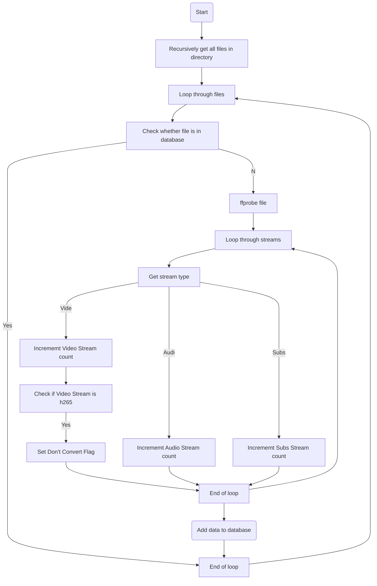
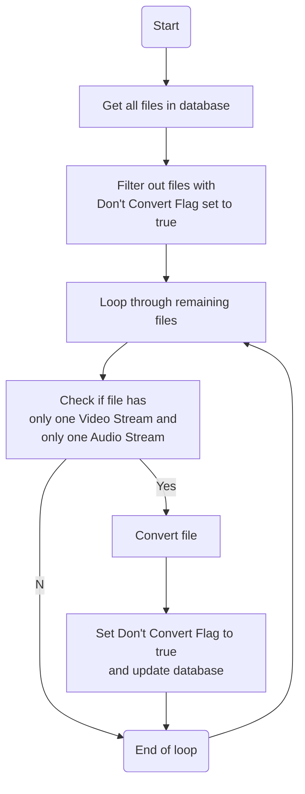
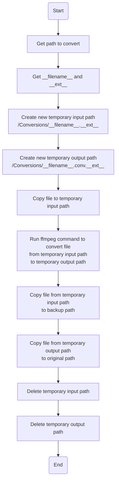

# convert-to-h265

This is a simple script to convert all videos in a directory to h265 using ffmpeg.

## Flowchart for file discovery

## Flowchart for conversion

## Flowchart for file manipulation

