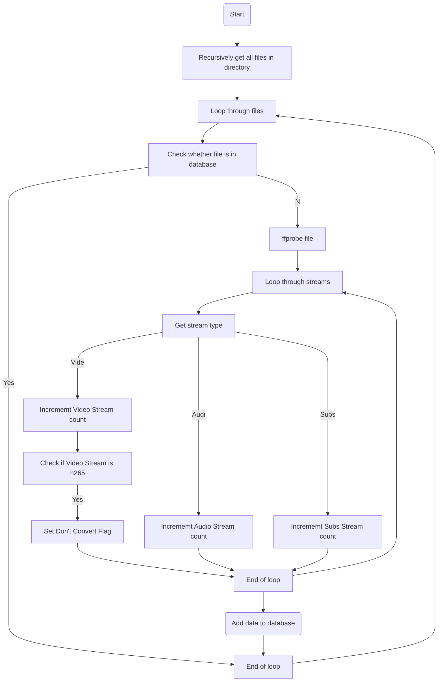
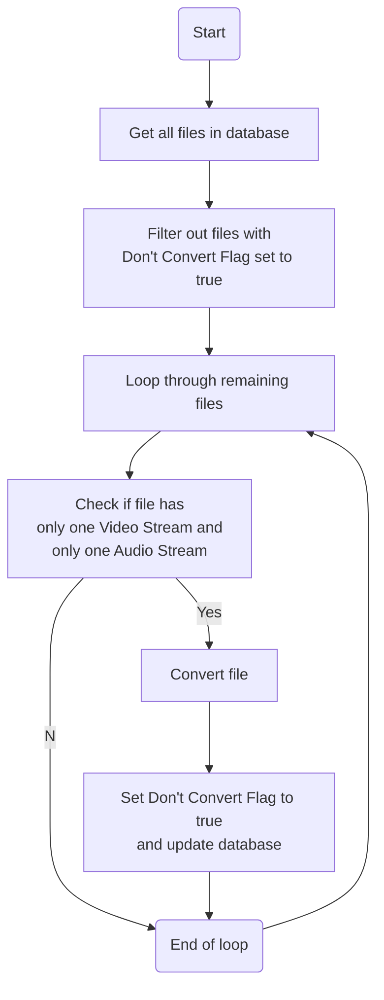
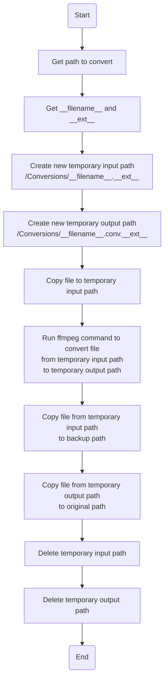

# convert-to-h265

This is a simple script to convert all videos in a directory to h265 using ffmpeg.

## Deployment

The project now supports a split deployment model:

- Docker walker on the NAS with direct access to the media drives
- Native macOS converter on the Mac Mini using `hevc_videotoolbox`

The walker continues writing canonical Docker-style paths like `/Media/...` into MongoDB. The native converter maps those paths to `/Volumes/Media/...` before accessing the filesystem.

## Shared prerequisites

In order to send notifications the following files are needed in the `src/secrets` directory:

- `claims.json` - Claims file
- `private_key.pem` - Private key file
- `public_key.pem` - Public key file

## Docker walker

The NAS walker continues using Docker and should keep mounting the media share at `/Media` inside the container.

If you use the Docker compose files that mount SMB shares directly, create a `.env` file in the repo root with:

```
SMB_HOST=your_smb_host
SMB_SHARE=your_smb_share
SMB_USER=your_smb_username
SMB_PASS=your_smb_password
```

## Native macOS converter

The native converter is installed with the macOS scripts in `scripts/macos`.

### Native prerequisites

1. Install ffmpeg with `hevc_videotoolbox` support and ensure it is on `PATH`.
2. Create the macOS media mount at `/Volumes/Media`.
3. Ensure the repo Python environment exists at `.venv`, or ensure `python3` is available.
4. Keep MongoDB reachable from the Mac Mini.

### Install

Run:

```bash
./scripts/macos/install_converter_service.sh
```

The installer will:

- create `~/Library/Application Support/convert-to-h265/config.toml` if it does not exist
- create `~/Library/Application Support/convert-to-h265/converter.env` if it does not exist
- create and refresh an installer-managed runtime copy under `~/Library/Application Support/convert-to-h265/runtime`
- install the launchd plist in `~/Library/LaunchAgents`
- install helper commands into `~/.local/bin`
- add `~/.local/bin` to the zsh `PATH` through a managed block in `~/.zshrc`

After running the installer, open a new terminal or run `source ~/.zshrc` so `start_converter` and the other helper commands are available in the current shell.

The launchd service runs from the Application Support runtime copy rather than directly from the repo checkout. This avoids macOS permission failures when the repo lives under protected folders such as `Documents`.

If `DB_URL` is still unset in the generated `converter.env`, the installer will stop short of starting the service. Set `DB_URL` and then run `start_converter`.

### Native config defaults

The generated native config uses these key defaults:

- source media is accessed through `/Volumes/Media`
- MongoDB filenames rooted at `/Media/...` are mapped to `/Volumes/Media/...`
- temporary conversion files are staged in `/tmp/Movies/convert-to-h265-work`
- `hevc_videotoolbox` is used with `-q:v 55 -g 240 -keyint_min 240 -realtime 0`

### Service control

After installation, the following commands are available:

- `start_converter`
- `stop_converter`
- `restart_converter`
- `status_converter`
- `uninstall_converter`

`uninstall_converter --purge` also removes generated config, logs, and working files.

## Flowchart for file discovery


```mermaid
graph TD
    A(Start) --> B[Recursively get all files in directory]
    B --> C[Loop through files]
    C --> D[Check whether file is in database]
    D --No--> E[ffprobe file]
    D --Yes--> O
    E --> F[Loop through streams]
    F --> G[Get stream type]
    G --Video--> H[Incrememt Video Stream count]
    G --Audio--> I[Incrememt Audio Stream count]
    G --Subs--> J[Incrememt Subs Stream count]
    H --> K[Check if Video Stream is h265]
    K --Yes--> L[Set Don't Convert Flag]
    L --> M[End of loop]
    I --> M
    J --> M
    M --> F
    M --> N(Add data to database)
    N --> O[End of loop]
    O --> C
```

## Flowchart for conversion


```mermaid
graph TD
    A(Start) --> B[Get all files in database]
    B --> C[Filter out files with\nDon't Convert Flag set to true]
    C --> D[Loop through remaining files]
    D --> E[Check if file has\nonly one Video Stream and\nonly one Audio Stream]
    E --Yes--> F[Convert file]
    F --> G[Set Don't Convert Flag to true\nand update database]
    E --No--> H(End of loop)
    G --> H
    H --> D
```

## Flowchart for file manipulation

```mermaid
graph TD
    A(Start) --> B[Get path to convert]
    B --> C[Get __filename__ and __ext__]
    C --> D[Create new temporary input path\n/Conversions/__filename__.__ext__]
    D --> E[Create new temporary output path\n/Conversions/__filename__.conv.__ext__]
    E --> F[Copy file to temporary input path]
    F --> G[Run ffmpeg command to convert file\nfrom temporary input path\nto temporary output path]
    G --> H[Copy file from temporary input path\nto backup path]
    H --> I[Copy file from temporary output path\nto original path]
    I --> J[Delete temporary input path]
    J --> K[Delete temporary output path]
    K --> L(End)
```
